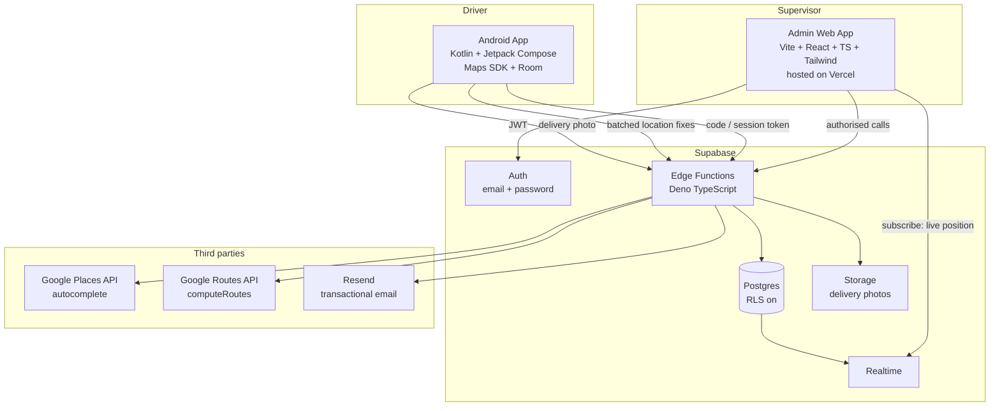
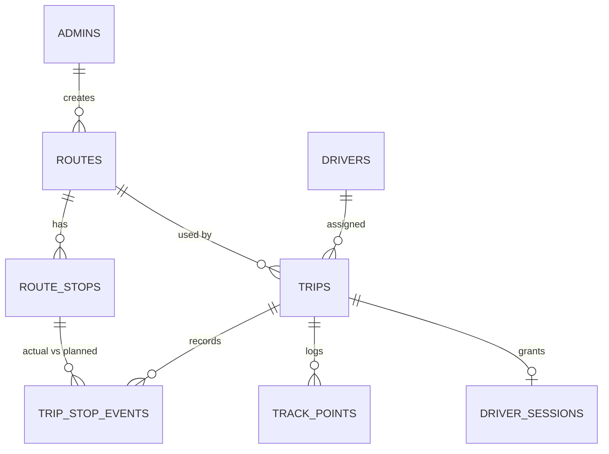
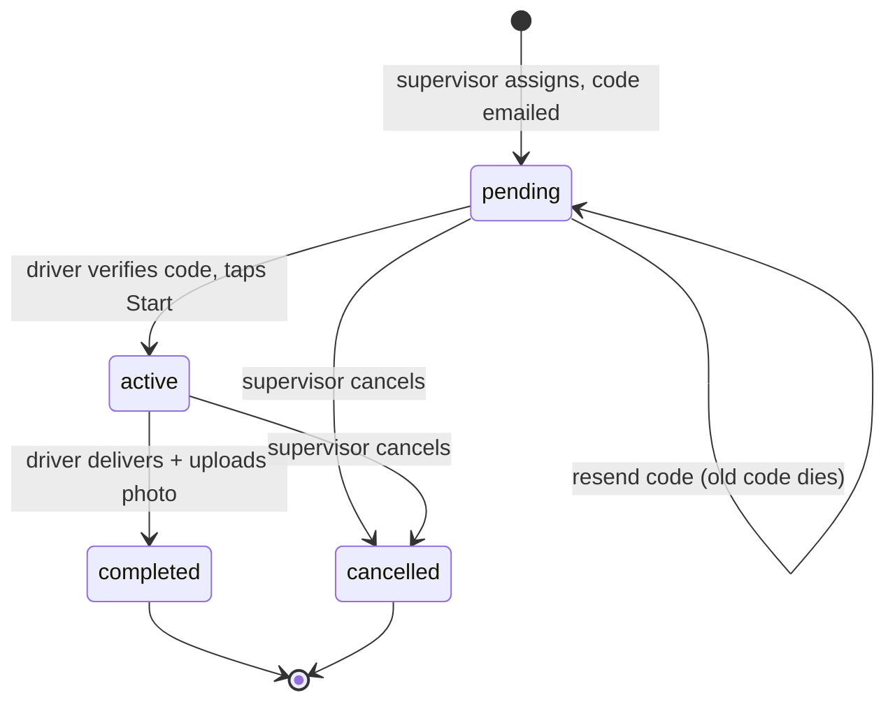

# Humble Drive — Product Requirements Document

**Version:** 1.0 (draft)
**Date:** 2026-08-20
**Owner:** Humble Coders
**Status:** Awaiting manager sign-off

---

## 1. Overview & Vision

Humble Drive is a two-platform consignment dispatch system.

A **supervisor** uses a web dashboard to plan a delivery run: pick a source and destination with type-ahead address search, compare up to three routes the Google Routes API returns, add planned **rest and food stops** along the chosen route, attach the consignment details, assign the run to a driver, and email that driver a one-time booking code.

A **driver** opens the Android app, types the code from their email, and the run appears: the route drawn on a map, the ordered break stops with their planned durations, and the consignment they are carrying. From there the app tracks their position live, records when they arrive at and leave each break stop, and closes the run with a photo at the destination. The supervisor watches the vehicle move on a live map the whole time.

The system is built as a **teaching and portfolio project**. It is meant to be realistic enough to demonstrate real engineering — race-safe backend state, background location on Android, offline queueing, third-party API integration behind a proxy — without carrying commercial compliance obligations.

### Why it is worth building

It forces every part of a modern stack into one product: a typed React frontend against a live third-party mapping API, a Postgres data model with real invariants, a credential flow with hashed one-time codes, a native Android foreground service, local persistence for offline resilience, and realtime data flowing back the other way. Very few student projects touch all of that honestly.

---

## 2. Goals & Non-Goals

### Goals

- **G1** — A supervisor can plan a complete delivery run in under three minutes, from empty form to code sent.
- **G2** — Route selection shows genuine alternatives with real distance and duration, not a single hardcoded path.
- **G3** — A driver gets from "code in email" to "route on screen" in one step, with no account, no password, and no signup.
- **G4** — The supervisor sees the driver's live position on a map while a run is active.
- **G5** — Location data survives loss of network. A tunnel or a dead zone degrades the trail's resolution, it does not create a permanent hole.
- **G6** — Planned versus actual break time is visible for every stop after the run.
- **G7** — Both surfaces work correctly on their intended form factors: the web app at 375 px, 768 px and 1280 px+, the Android app on a phone in a moving vehicle.

### Non-Goals for v1

- **Turn-by-turn voice navigation.** The app draws the route and hands off to Google Maps via a `google.navigation:` intent for actual guidance. Building a navigation engine is not the point of this project.
- **Multiple consignments per run.** One run carries one consignment. No manifests, no line items, no per-stop parcels.
- **Deliveries at intermediate stops.** Intermediate stops are driver breaks only. Nothing is loaded or unloaded there.
- **Driver accounts.** Drivers never register, never set a password, never have a profile. The emailed code is the entire identity mechanism.
- **Route optimisation.** The supervisor's stop order is the stop order. We do not reorder waypoints for efficiency.
- **Geofenced automatic stop completion.** Arrival detection is proximity-based and advisory; the driver confirms.
- **ETA recalculation during the run.** The planned duration is computed once, at assignment time.
- **Multi-tenancy.** One organisation, one Supabase project, one set of supervisors.
- **Public Play Store release.** See Open Decision OD-1.
- **Payments, invoicing, pricing, fuel logs, vehicle maintenance.**

---

## 3. Target Users & Roles

| Role | Count | How they authenticate | What they can do |
|---|---|---|---|
| **Supervisor (admin)** | 1–5 | Supabase Auth, email + password, **invite only** | Everything: manage drivers, plan routes, assign runs, send codes, watch live tracking, review completed runs |
| **Driver** | 5–50 | One-time emailed code, exchanged for a device-bound session token | View their own assigned run, report position, mark break stops, complete the delivery with a photo |
| **Public** | — | None | Nothing. There is no public surface. |

There is no supervisor hierarchy in v1. Every supervisor can see and act on every run.

---

## 4. System Architecture

### 4.1 Component map

### 4.2 Architectural rules

These are binding. Tickets that violate them get rejected.

1. **The database is the enforcement layer; the UI is never.** One active run per driver, single-use codes, valid state transitions, and stop ordering are enforced by Postgres constraints and by logic inside the Edge Functions — not by disabling a button in React.

2. **Row Level Security is on everywhere, with zero policies on `drivers`, `routes`, `route_stops`, `trips`, `driver_sessions`, and `track_points`.** All access flows through Edge Functions holding the service role key. The single exception is a Realtime read feed for the admin live map, and that feed is gated by an authenticated supervisor JWT — never by the anon key.

3. **No third-party API key ever reaches a client.** The Google Maps key and the Resend key live in Supabase Edge Function secrets. The browser calls `places-autocomplete` and `routes-preview` on our own backend; our backend calls Google. This is the single most important cost-protection decision in the project — a leaked Maps key with billing enabled is an unbounded liability.

4. **The driver app holds no privileged logic.** It renders what `driver-verify` handed it and reports what it observes. It cannot enumerate runs, look up other drivers, or reach any table directly.

5. **Codes are single-use and hashed at rest.** A code is generated only by the supervisor's "assign" or "resend" action, SHA-256 hashed before storage, and dead the moment it is redeemed. Plaintext codes are never logged, never stored, and never returned by any endpoint after the sending email is dispatched.

6. **Frontend stack is locked:** Vite + React 18 + TypeScript in strict mode + Tailwind. Functional components and hooks only. No Redux, no MobX, no UI kit. `@supabase/supabase-js` for auth, RPC and realtime. React Router for routing.

7. **Android stack is locked:** Kotlin, Jetpack Compose, Maps SDK for Android, `FusedLocationProviderClient`, Room for the offline queue, **Retrofit + kotlinx.serialization** for HTTP, and **manual dependency injection — no DI framework**. MVVM, one ViewModel per screen. minSdk 26, target the current stable SDK.

8. **Theme tokens are inherited from humblecoders.in and are not reinvented:** bg `#07090f` · card `#0f131c` · secondary `#161b27` · muted `#1a2030` · text `#f4f6fb` · muted-text `#94a0b8` · brand `#4263a6` · brand-2 `#5b7cc4` · border `#5b7cc424` · gold accent `#f5c451` · radius `0.875rem` · Inter, with Caveat for the logo script. Dark theme only. Defined once in the Tailwind config and once in the Compose theme; never ad-hoc hex in a component.

### 4.3 The constraint that shapes the whole planning flow

> **The Google Routes API returns alternative routes only when the request has no intermediate waypoints.** Setting `computeAlternativeRoutes: true` alongside `intermediates` yields exactly one route.

This is not a workaround we chose; it is how the API behaves, and the product flow is built around it:

1. Request A → B with `computeAlternativeRoutes: true` and **no** stops. Get up to three routes.
2. Supervisor picks one.
3. Supervisor adds break stops.
4. Re-request that same corridor with `intermediates` set and alternatives **off**. Get one refined route: new polyline, new distance, new drive duration.

The UI must make this legible. Once stops exist, the supervisor is refining their chosen route, not re-picking among three. The route cards collapse into a single summary at that point.

### 4.4 Data model

**`admins`** — `user_id` (FK to `auth.users`, PK), `name`, `active`, `created_at`.
Membership in this table, with `active = true`, is what makes an authenticated user a supervisor. Having a Supabase Auth account is not sufficient.

**`drivers`** — `id`, `name`, `email` (lowercase, enforced by check constraint), `phone`, `active`, `created_at`.
Email is lowercase-only for the same reason it is in the booking project: two casings of one address are two records for one human, and every per-driver invariant silently breaks.

**`routes`** — `id`, `name`, `origin_name`, `origin_place_id`, `origin_lat`, `origin_lng`, `dest_name`, `dest_place_id`, `dest_lat`, `dest_lng`, `encoded_polyline`, `distance_m`, `drive_duration_s`, `provider_response` (jsonb, the raw Routes API reply for debugging), `created_by`, `created_at`.

**`route_stops`** — `id`, `route_id`, `seq`, `name`, `place_id`, `lat`, `lng`, `stop_type` (`break | food | fuel | other`), `planned_minutes`.
Unique on `(route_id, seq)`. Stop order is data, not array position in a JSON blob.

**`trips`** — `id`, `route_id`, `driver_id`, `code_hash`, `code_sent_at`, `status`, `consignment_ref`, `consignment_desc`, `weight_kg`, `receiver_name`, `receiver_phone`, `started_at`, `completed_at`, `pod_photo_path`, `created_by`, `created_at`.
Partial unique index on `driver_id where status in ('pending','active')` — a driver cannot hold two live runs.

**`driver_sessions`** — `id`, `trip_id`, `token_hash`, `device_label`, `created_at`, `last_seen_at`, `revoked_at`.

**`trip_stop_events`** — `id`, `trip_id`, `route_stop_id`, `arrived_at`, `resumed_at`.
`resumed_at - arrived_at` is the actual break duration, compared against `route_stops.planned_minutes`.

**`track_points`** — `id`, `trip_id`, `lat`, `lng`, `speed_mps`, `heading_deg`, `accuracy_m`, `recorded_at` (device clock, when the fix was taken), `received_at` (server clock, when it arrived).
Two timestamps because offline batching means these differ, sometimes by hours, and the trail must be reconstructable in true chronological order.

### 4.5 Trip state machine

Transitions are validated server-side in the Edge Functions. `completed` and `cancelled` are terminal — nothing reopens a closed run.

### 4.6 API surface

Everything is an Edge Function. There are no public RPCs and no direct table access from any client.

**Supervisor endpoints** — authorised by a Supabase Auth JWT, then checked against `admins` for an active row:

| Endpoint | Purpose |
|---|---|
| `places-autocomplete` | Proxy to Google Places, region-biased to India, session-token aware |
| `routes-preview` | Proxy to Routes API. Without `stops`: up to 3 alternatives. With `stops`: one refined route |
| `drivers` | List, create, update, deactivate |
| `trips-create` | Persist route + stops + consignment, create the trip, generate and email the code |
| `trips-resend` | Generate a fresh code, overwrite the hash, re-send. Previous code dies instantly |
| `trips-list` | Dashboard listing with filters by status and driver |
| `trips-detail` | One run: route, stops, planned vs actual, track trail, photo URL |
| `trips-cancel` | Terminal cancel |

**Driver endpoints** — `code` for the first call, then a bearer session token:

| Endpoint | Purpose |
|---|---|
| `driver-verify` | Exchange a code for a session token plus the full run payload |
| `driver-run` | Re-fetch the current run for a live session, so a device can refresh stale cached data |
| `driver-start` | `pending` → `active` |
| `driver-track` | Accept a batch of location fixes |
| `driver-stop-event` | Record arrival at, or departure from, a break stop |
| `driver-complete` | Upload the delivery photo and close the run |

### 4.7 Error contract

Fixed and closed. Every code below must be handled by both clients with friendly, plain-English copy. Adding a code requires updating this document.

**Driver-facing:** `invalid_code` · `code_already_used` · `trip_cancelled` · `trip_completed` · `unauthorized` · `session_expired` · `bad_request`

**Supervisor-facing:** `unauthorized` · `not_admin` · `driver_inactive` · `driver_busy` · `not_found` · `invalid_transition` · `places_failed` · `routes_failed` · `email_failed` · `bad_request`

`unauthorized` is checked before anything else on every endpoint, so an unauthenticated request does no work and leaks nothing.

---

## 5. Feature Specification

### 5.1 Supervisor — authentication

Invite-only. Supervisor accounts are created from the Supabase dashboard and a matching row is added to `admins`. **There is no signup route in the application.** The login page offers email, password, and password reset. Nothing else.

A user who authenticates successfully but has no active `admins` row is signed out immediately with a plain message: this account is not authorised for Humble Drive.

### 5.2 Supervisor — driver management

A simple table: name, email, phone, active toggle, and the driver's current run if any. Creating a driver validates that the email is lowercase and unique. Deactivating a driver with a live run is blocked with `driver_busy`.

### 5.3 Supervisor — the planning wizard

Four steps, with state preserved across back-navigation.

**Step 1 — Source and destination.**
Two inputs backed by `places-autocomplete`, debounced at roughly 300 ms, biased to the operating region. We store `place_id`, the display name, and the coordinates. We never store only the typed string — the string is what the user typed, the `place_id` is what they meant.

**Step 2 — Choose the route.**
`routes-preview` returns up to three alternatives. All three are drawn on a single map with the selected one highlighted; a card list beside it shows each route's duration, distance and road summary — "1 hr 12 min · 46 km · via NH-44". Selecting a card highlights the corresponding polyline. Nothing is written to the database yet.

**Step 3 — Add break stops.**
An autocomplete input appends stops to an ordered, drag-reorderable list. Each stop carries a type (break, food, fuel, other) and a planned duration in minutes. Every change re-calls `routes-preview` with `intermediates` set, returning one refined route. The step header shows the running total honestly: **drive time + total planned break time = total run time.** Alternatives are no longer offered here, per §4.3, and the UI says so rather than silently dropping two cards.

**Step 4 — Consignment, driver, and send.**
Consignment reference, description, optional weight, receiver name, receiver phone. A driver picker that excludes inactive and already-busy drivers. A final summary card. On submit, the backend writes the route, its stops and the trip in **one transaction**, generates the code, and dispatches the email. Partial state is never left behind: if the email fails, the trip is still created and appears as awaiting-code with a resend button, rather than the whole plan being lost.

### 5.4 Supervisor — live tracking and history

A dashboard listing runs by status. Opening an active run shows the planned polyline, the break stops, and the driver's live marker, updated over Supabase Realtime as new `track_points` arrive. Stops that have been reached show actual versus planned break time, with overruns flagged.

A completed run shows the same view frozen, plus the full breadcrumb trail and the delivery photo.

### 5.5 Driver — code entry

A single field. Six characters, drawn from `A-Z2-9` with `O` and `I` removed so that nothing can be confused with zero or one. Case-insensitive on entry. On success, `driver-verify` returns a session token — stored in `EncryptedSharedPreferences` — and the complete run payload, which is cached to Room immediately so the app works from that point on with no network at all.

The code is dead once redeemed. The session token is the credential from then on, and re-opening the app skips straight to the run.

### 5.6 Driver — the run

**Overview screen:** the route on a map, the ordered stops with types and planned durations, the consignment card, and total planned time. A prominent Start button.

**Active screen:** live position on the route, the next stop and its distance, an "Open in Google Maps" button that fires a `google.navigation:` intent with the remaining waypoints, and the current stop's controls.

**Break stops:** the app detects proximity to a stop (roughly 100 m) and prompts. The driver confirms arrival, a timer runs showing elapsed against planned, and the driver taps Resume when done. **Nothing is blocked.** A driver who needs to leave early leaves early; the overrun or undershoot is recorded, not prevented.

**Completion:** at the destination, the driver taps Delivered and attaches one photo, which uploads to Supabase Storage. Only then does the run move to `completed`, the foreground service stop, and location tracking end.

### 5.7 Driver — location tracking

This is the hardest part of the build and the part most likely to be got wrong.

- A **foreground service** declared with `foregroundServiceType="location"` and a persistent notification. Without it, Android stops delivering location the moment the screen sleeps — and the driver's screen will be off for most of the run.
- `FusedLocationProviderClient` at `Priority.HIGH_ACCURACY`, roughly 5-second interval, 10-metre minimum displacement.
- Every fix is written to a **Room** table first, then flushed to `driver-track` in batches every 15–30 seconds, with rows deleted only on server acknowledgement. The network is treated as unreliable by default, because on a highway it is.
- Permissions are requested as a ladder: `ACCESS_FINE_LOCATION` at first use, then `ACCESS_BACKGROUND_LOCATION` as a separate, later request behind a rationale screen that explains exactly why a delivery app needs it.
- The app prompts for a battery-optimisation exemption. Without it, aggressive OEM battery managers — Xiaomi, Oppo, Vivo, OnePlus especially — will silently kill the service mid-run and the trail will simply stop.
- Tracking runs only while a trip is `active`. Never before Start, never after completion.

---

## 6. Non-Functional Requirements

**Responsiveness.** The admin web app is an acceptance criterion at 375 px, 768 px and 1280 px+, not a nice-to-have. The planning wizard's map-plus-list layout stacks vertically below 768 px.

**Performance.** Autocomplete suggestions within roughly 400 ms of the debounce firing. Route preview within roughly 2 s. The live marker within roughly 5 s of a fix reaching the server.

**Reliability.** No location fix is lost to a transient network failure. A crash or force-close mid-run resumes cleanly from the Room queue and the cached run.

**Security.** No third-party key in any client bundle or APK. Codes hashed, single-use, never logged. RLS on with no permissive policies. Session tokens revocable per trip. Delivery photos in a private Storage bucket, served through short-lived signed URLs.

**Cost.** Routes API calls are the expensive ones. `routes-preview` results are cached briefly server-side so that reordering stops does not re-bill an identical request, and the endpoint is rate-limited per supervisor.

**Privacy.** Location data is trip-scoped. There is no tracking of a driver outside an active run, and the app makes that explicit in its rationale screen. Retention is defined in Open Decision OD-3.

**Accessibility.** Keyboard navigation throughout the admin app, visible focus states, and colour contrast meeting WCAG AA against the dark palette.

---

## 7. Open Decisions

These need a manager call before the tickets they affect can be drafted. **Numbers are never reused or renumbered** — resolved items stay in place so that tickets referencing them keep pointing at the right thing.

**OD-1 — Android distribution. ✅ RESOLVED** → internal testing / direct APK. See decision **D-30**.

**OD-2 — Push notifications to the driver.** Should assignment and cancellation notify the phone, or is email plus opening the app sufficient? *Recommendation: out of v1. FCM is a meaningful chunk of work for little demo value here.*

**OD-3 — Location data retention.** How long do `track_points` live? *Recommendation: 90 days, then a scheduled purge, with the aggregate trail kept on the trip record. Cheap to implement and a good thing to have thought about.*

**OD-4 — Session token lifetime. ✅ RESOLVED** → expires with its trip. See decision **D-26**.

**OD-5 — Vehicle records.** Should a trip reference a vehicle (registration, type, capacity)? *Recommendation: out of v1. It adds an entity and changes nothing about the core flows.*

---

## 8. Decision Log

Every locked choice, with the reasoning that produced it. This log is binding: changing an entry requires a new decision, not a quiet edit.

| # | Decision | Rationale |
|---|---|---|
| D-1 | Built as a teaching and portfolio project, not a commercial product | Sets the bar: realistic engineering, no compliance obligations, small user counts |
| D-2 | A run carries exactly one consignment, source to destination | Keeps the model honest without turning into a logistics ERP |
| D-3 | Intermediate stops are driver rest, food and fuel breaks with a planned duration — **not** delivery points | This is the defining domain decision. Nothing is loaded or unloaded at a stop |
| D-4 | Live GPS tracking is in v1, in simple form | Live marker for the supervisor; no geofenced auto-completion, no replay, no live ETA. This is the core Android engineering and is worth proving early |
| D-5 | Drivers are created by supervisors; no self-registration | Mirrors the booking-code pattern already proven at Humble Coders |
| D-6 | Consignment data is light: reference, description, optional weight, receiver name and phone | Enough to be realistic, not enough to become a manifest system |
| D-7 | Delivery is confirmed by a tap plus one photo, at the destination only | Demonstrates Android file upload and Supabase Storage; a delivery app with no proof feels hollow |
| D-8 | Break durations are tracked and displayed, never enforced | Planned versus actual is visible to the supervisor. Blocking a driver from resuming would be frustrating and hard to demo |
| D-9 | The app queues location fixes and status changes locally in Room and syncs when connectivity returns | Highway connectivity is unreliable by default. Online-only would put permanent holes in every trail |
| D-10 | Backend is Supabase: Postgres, Auth, Edge Functions, Realtime, Storage | Team already runs this stack; Realtime is precisely what the live marker needs; Storage covers the photo |
| D-11 | Supervisor auth is Supabase Auth email + password, **invite only, with no signup route** | Nobody can register themselves into a dispatch system. An `admins` table gates access on top of authentication |
| D-12 | All Google Maps API calls are proxied through Edge Functions; the key never reaches a client | A leaked key with billing enabled is an unbounded liability. The proxy also enables caching and rate limiting |
| D-13 | Admin web app deploys to Vercel | Already in use at Humble Coders; push-to-deploy, custom subdomain, free tier is ample |
| D-14 | Frontend is Vite + React 18 + TypeScript strict + Tailwind, no UI kit, no state library | Matches the existing Humble Coders stack and keeps the learning surface on React itself |
| D-15 | Android is Kotlin + Jetpack Compose + Maps SDK + Room, minSdk 26 | Background location makes cross-platform frameworks painful; native is the right call here |
| D-23 | Android follows **MVVM** with one ViewModel per screen and a single `StateFlow<UiState>` | Compose and this layering assume it; writing it down stops two screens being built two different ways |
| D-24 | Dependency injection is **manual** via an `AppContainer` and explicit ViewModel factories — no Hilt, no Koin | Keeps the wiring visible and readable for a teaching project, and removes an annotation processor from the build. The cost is boilerplate in `AppContainer`, accepted deliberately |
| D-25 | A **second** Google key, restricted to the Maps JavaScript API and by HTTP referrer, is allowed in the browser purely to render maps | Interactive maps cannot be drawn server-side, and Google's terms forbid displaying Google route data on a non-Google basemap, so OpenStreetMap is not available to us. The key cannot call any billed-per-request endpoint, so the liability rule 3 protects against does not apply |
| D-26 | A driver session token **expires with its trip** — when the trip completes or is cancelled (resolves former OD-4) | A run is naturally bounded, so the run is the natural session lifetime. No timer to tune, and no driver logged out mid-journey |
| D-27 | Android HTTP is **Retrofit + kotlinx.serialization** | The conventional, best-documented Android choice, and it constructs cleanly by hand in `AppContainer`, which matters under manual DI |
| D-28 | The driver app supports **both orientations** | Drivers use phone mounts in either orientation; the map screens in tickets 10 and 12 benefit from landscape |
| D-29 | The Android app gets its **own** map key — Maps SDK for Android only, restricted by package name and signing SHA-1 | Same reasoning as D-25, applied per platform. Three keys total: one billed server key held only by Edge Functions, and two render-only client keys that cannot call Places or Routes |
| D-30 | The driver app is distributed via **Play Console internal testing or direct APK**, not a public Play Store listing (resolves OD-1) | A public listing needs a background-location justification and a demo video, and the review routinely takes weeks and fails first time. Wrong risk for a teaching project; a public release can be its own later project |
| D-31 | Location sampling is **5 s / 10 m at high accuracy**, flushed to the server in batches every 15–30 s | Smooth trail at acceptable drain for a mounted phone that is usually charging. Easy to relax later; hard to explain a jagged trail now |
| D-32 | Service survival uses **both** a battery-optimisation exemption prompt **and** a WorkManager watchdog that restarts a service that should be running | The prompt is refusable and some OEMs kill services regardless, so neither mechanism alone is sufficient |
| D-16 | Route alternatives are fetched **before** stops are added; adding stops refines the one chosen route | Forced by the Routes API: alternatives and intermediate waypoints are mutually exclusive. The UI is built around this rather than fighting it |
| D-17 | Booking codes are 6 characters from `A-Z2-9` minus `O` and `I`, SHA-256 hashed, single-use; a resend kills the previous code | Removes zero/one lookalikes for a driver reading an email in a cab. Same discipline as the booking project |
| D-18 | Turn-by-turn navigation is delegated to Google Maps via intent | Building a navigation engine is a year of work and teaches nothing this project needs |
| D-19 | The database is the enforcement layer; the UI is never | One active run per driver, single-use codes, and valid transitions are Postgres constraints and server logic, not disabled buttons |
| D-20 | RLS on with zero permissive policies; all access via Edge Functions with the service role | The clients are untrusted. The driver app in particular ships to devices we do not control |
| D-21 | Theme tokens are inherited from humblecoders.in; dark theme only | Visual consistency across Humble Coders products. Colours are defined once per platform, never ad-hoc in a component |
| D-22 | Stop order is the supervisor's order; no waypoint optimisation | Breaks are chosen for where the driver will actually want them, not for path efficiency |

---

## 9. Suggested Build Order

Each phase ends somewhere demoable.

1. **Foundation** — Supabase project, schema and constraints, Edge Function skeleton, supervisor auth with the `admins` gate.
2. **Maps proxy** — `places-autocomplete` and `routes-preview`, with the Google key, billing, and quotas configured correctly. Prove the three-alternatives behaviour and the waypoint constraint here, before any UI depends on it.
3. **Planning wizard** — all four steps, plus driver management. Ends with a real code landing in a real inbox.
4. **Driver app, static** — code entry, session token, run display from cache. End to end with no tracking yet.
5. **Driver app, tracking** — foreground service, Room queue, batched upload, the permission ladder. The hardest phase; budget accordingly.
6. **Live map** — supervisor Realtime view, break-stop events, planned versus actual.
7. **Completion and history** — delivery photo, trip detail, breadcrumb replay.

Phases 1–4 give a demoable end-to-end system. Phase 5 is where the real engineering time goes.

---

## 10. Next Steps

1. Settle the five open decisions in §7.
2. Run **`/draft-architecture`** to turn this PRD into the new repo's `CLAUDE.md`.
3. Run **`/draft-ticket`** for phase 1, the schema and auth foundation.
